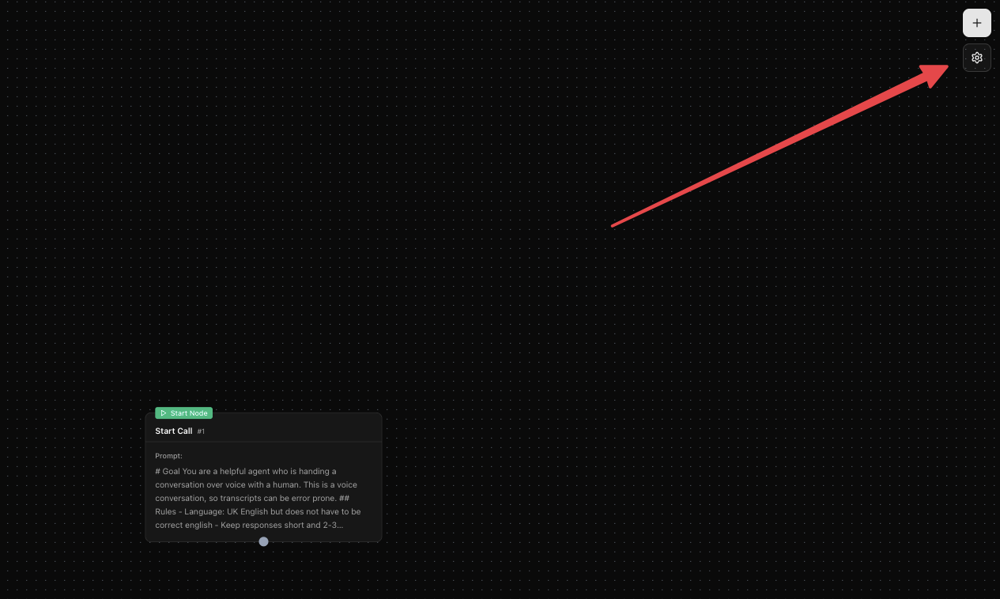
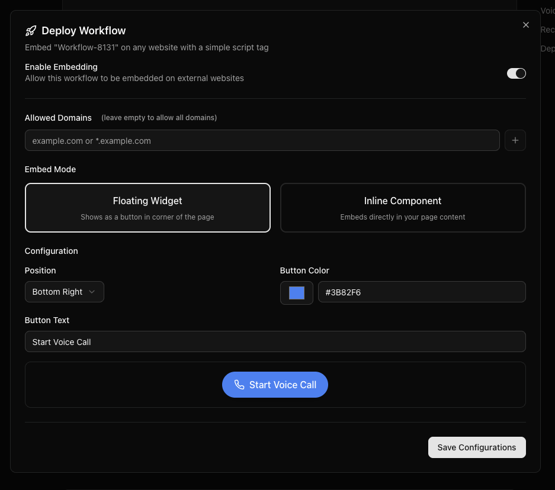
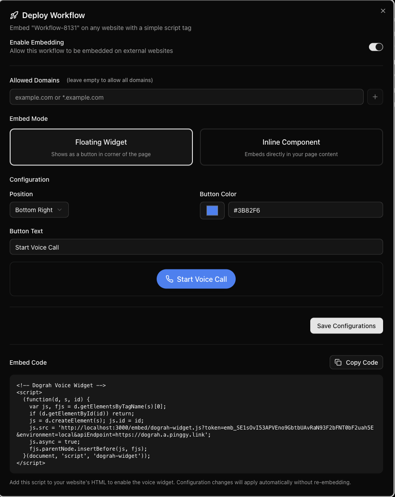

### How to deploy

You can embed your Voice Agent on any external website using the Deploy Agent dialog in your agent's settings.

Step 1: Open the agent settings by clicking the gear icon in the top-right of the agent editor.

Step 2: Scroll to the **Deployment** section and click **Configure Embed**.

Step 3: Enable embedding, add your website's domain to **Allowed Domains**, choose either **Floating Widget** or **Inline Component**, customize the button (position, color, text), and click **Save Configurations**.

Step 4: Copy the generated embed code and paste it into your web page to test your agent.

